# 💰 XpenseManager  

A smart and simple **Expense Management Android App** built with **Kotlin**, **Room Database**, and **MVVM architecture**.  
Track your expenses, categorize spending, analyze with charts, and stay on top of your finances with ease.  

---

## ✨ Features  

- 📌 **Add / Edit / Delete Expenses**  
- 📂 **Category Management** (create and remove custom categories)  
- 💳 **Payment Methods** supported: Cash & UPI  
- 🔎 **Search & Filter Expenses** by description, category, amount, or payment method  
- 📊 **Real-Time Analytics**  
  - Total Spending  
  - Spending by Category (Pie Chart)  
  - Cash vs UPI breakdown  
  - Transaction counts  
- 🗂 **Category-wise Expense List**  
- 🎨 **Modern UI** with Material Design  
- 💾 **Local Storage with Room DB**  

---

## 🖼 Screenshots  

  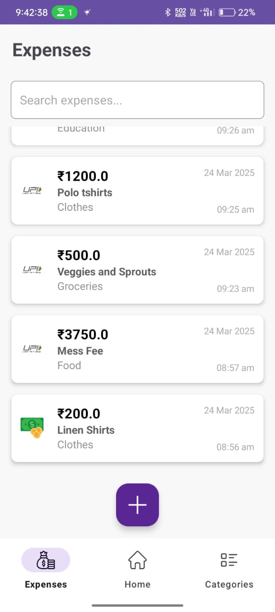
  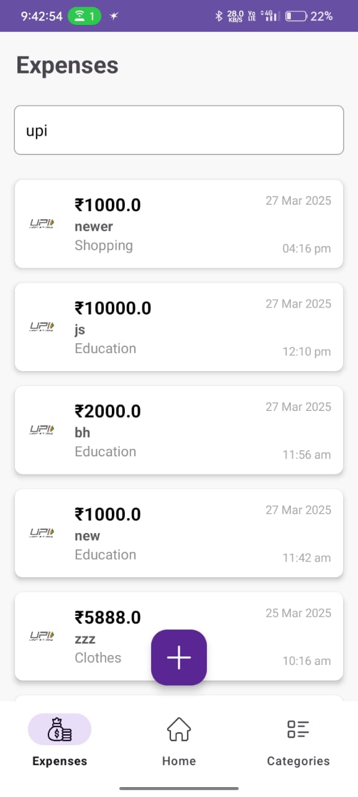
  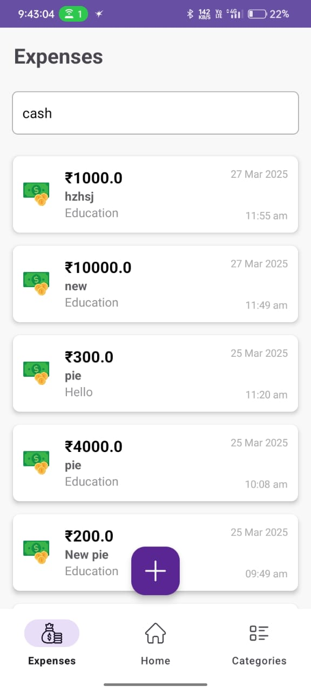
  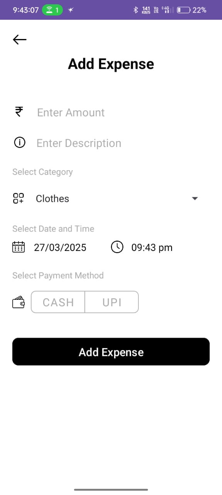
  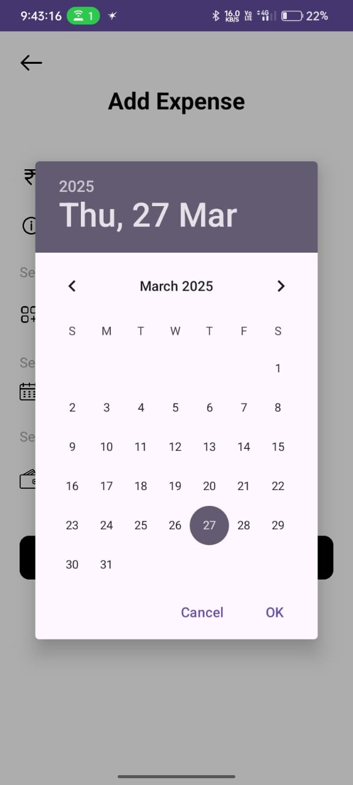
  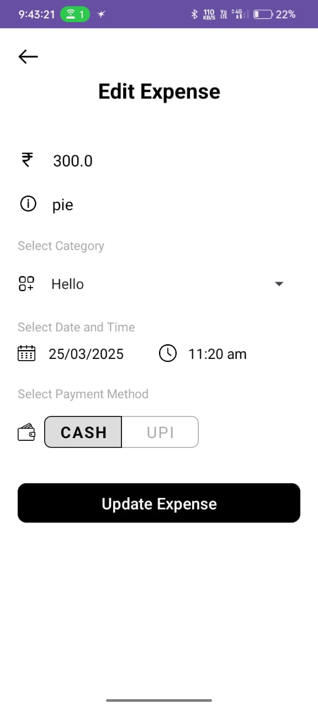
  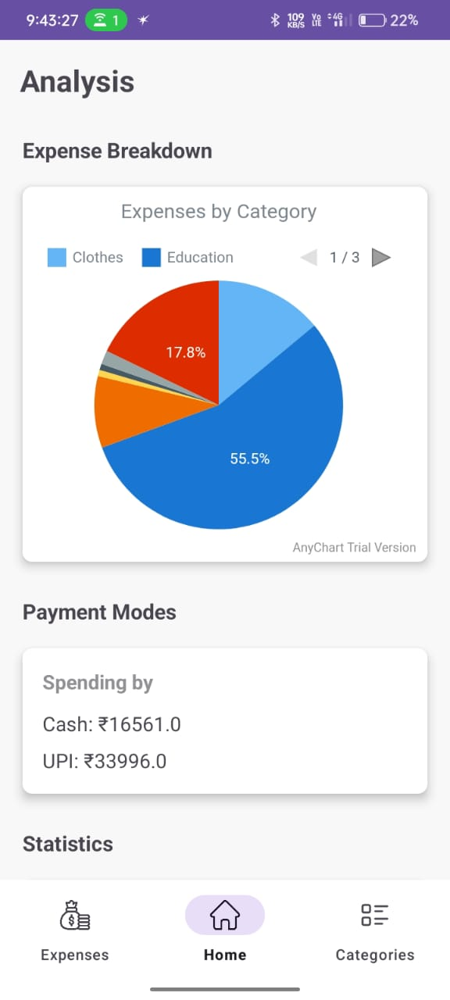
  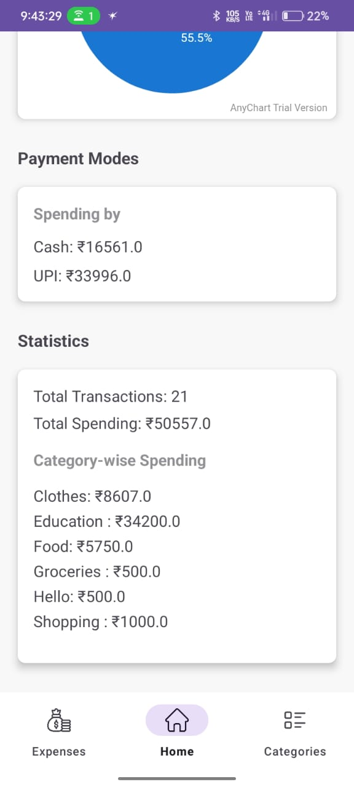
  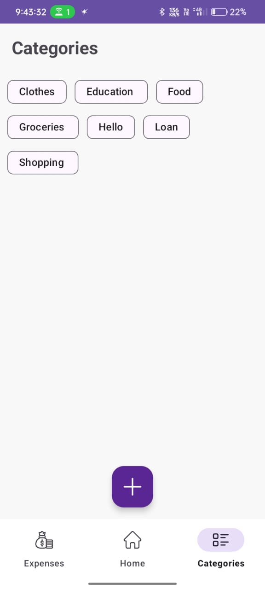
  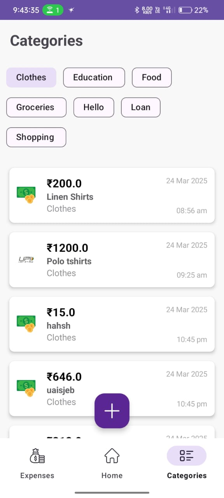
  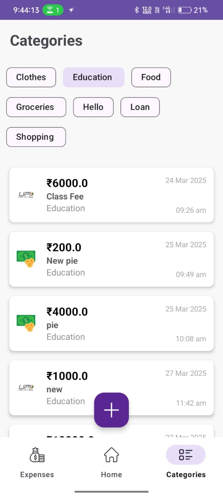
  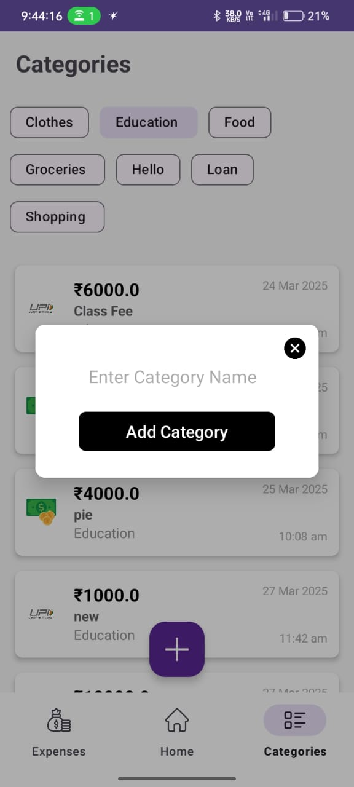
  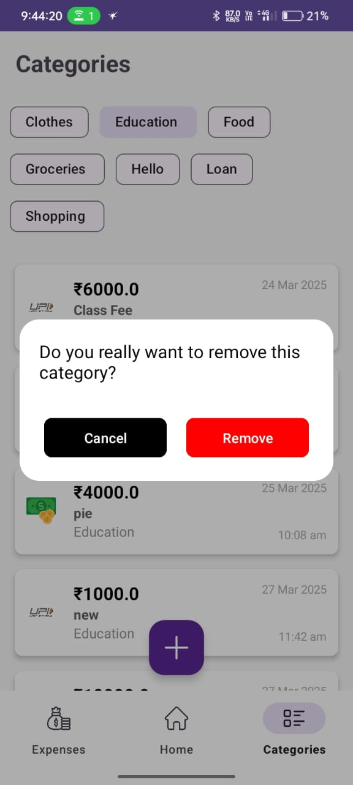
  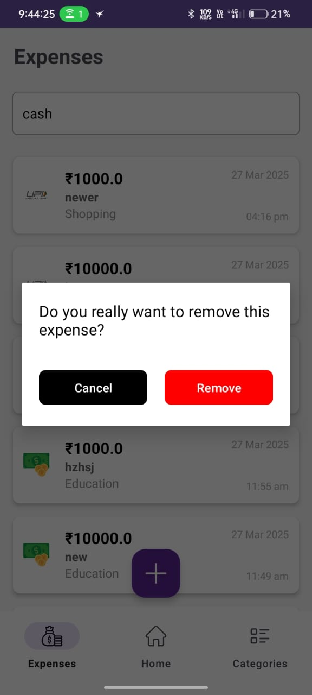

 

---

## 🛠 Tech Stack  

- **Language:** Kotlin  
- **Architecture:** MVVM (Model-View-ViewModel)  
- **Database:** Room (SQLite)  
- **UI:** Material Components, RecyclerView, ChipGroup, CardView  
- **Charts:** AnyChart library  

---

## 🚀 Getting Started  

### Prerequisites  
- Android Studio (latest version recommended)  
- Minimum SDK: 21 (Android 5.0 Lollipop)  

